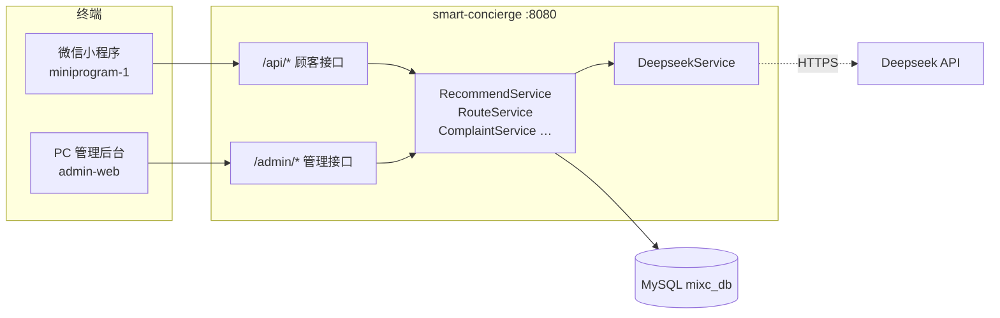

# 南通万象城 · Smart Concierge

面向商场场景的 **AI 智慧导购与服务中台**：为微信小程序提供智能问答、店铺推荐、路线规划等能力，并通过 PC 企业管理后台实现多角色运营闭环。

配套微信小程序见独立仓库/目录：`miniprogram-1`（WeChat Mini Program）。

---

## 项目特点

### 懂顾客的 AI 导购

- **分步引导 + 自由对话**：顾客先选咨询类型（美食 / 玩乐 / 购物 / 路线）与同行人数，再进入自然语言交流
- **Deepseek 大模型驱动**：对话回复、店铺筛选、推荐理由均可由 AI 生成；未配置 Key 时自动降级为规则引擎
- **复述原话，不瞎解读**：确认需求时引用顾客原话（如「重口味的」），不会擅自改成「想吃辣的」
- **偏好实时更新**：支持临时改口（先重口后改清淡、不想吃火锅等），以对话中**最新**描述为准
- **个性化推荐理由**：结合口味偏好、人数场景、店铺标签，并自然提及 `discount_info` 中的现存活动（如「第二杯半价」）
- **负向约束过滤**：顾客说「不想吃火锅」时，自动排除海底捞等火锅类店铺

### 智慧逛店路线

- **双模式输入**：勾选店铺，或用自然语言描述（「先看电影再去喜茶」）
- **意图映射**：将「电影」「奶茶」等口语映射到商场店铺清单
- **室内路网**：基于 `IndoorNode` / `NodeEdge` 估算步数与耗时
- **无障碍选项**：支持婴儿车、轮椅等偏好
- **AI 路线说明**：Deepseek 生成整体规划理由与各站点 visit 提示

### 顾客服务闭环

| 能力 | 小程序侧 | 后台侧 |
|------|----------|--------|
| 投诉求助 | 提交空调/卫生/失物等工单 | 客服分派、处理、查看脱敏手机号 |
| 失物招领 | — | 登记失物并与投诉工单智能匹配 |
| 品牌入驻提议 | 填写品牌 + 推荐理由、热门榜点赞 | 招商查看提议明细、导出、阈值配置 |
| 推荐记录 | 本地历史 | 运营查看每次 AI 推荐明细与理由 |

### 企业级 PC 后台

- **Vue 3 + Element Plus + ECharts**，按角色展示不同菜单
- **RBAC 四角色**：管理员、运营、客服、招商，JWT 鉴权
- **会员之声看板**：提问趋势、投诉分布、每日统计
- **店铺 / 活动管理**：维护楼层、标签、人均、优惠活动等推荐数据源
- **审计日志**：关键操作留痕，支持导出
- **Deepseek 监控**：配置状态、调用次数、成功率、平均延迟，区分「已配置」与「调用已生效」

### 工程化设计

- **AI 可开关、可降级**：`app.deepseek.enabled` + 本地/数据库双通道配置 API Key
- **推荐全链路落库**：`question_log` 记录意图、回复、推荐 JSON、是否调用 AI、响应耗时
- **安全基线**：Spring Security + JWT；顾客手机号 AES 加密存储
- **前后端分离**：后端 `:8080`，管理端 Vite 开发服务器 `:5173` 代理 `/api`

---

## 系统架构



---

## 技术栈

| 层级 | 技术 |
|------|------|
| 后端 | Java 17 · Spring Boot 3.4 · Spring Data JPA · Spring Security |
| 数据库 | MySQL 8（`mixc_db`） |
| AI | Deepseek Chat API（对话 / 推荐 / 路线 / 理由增强） |
| 管理前端 | Vue 3 · Vite 6 · Element Plus · Pinia · ECharts |
| 工具 | JWT · Hutool · EasyExcel · Lombok · Gradle |

---

## 目录结构

```
smart-concierge/
├── src/main/java/com/mixc/smartconcierge/
│   ├── controller/
│   │   ├── api/          # 小程序 REST 接口
│   │   └── admin/        # PC 后台 REST 接口
│   ├── service/          # 业务逻辑（推荐、路线、投诉、监控等）
│   ├── entity/           # JPA 实体
│   ├── repository/       # 数据访问
│   ├── security/         # JWT 过滤器与鉴权
│   └── config/           # 初始化数据、Web、异步等配置
├── src/main/resources/
│   └── application.properties
├── admin-web/            # Vue3 管理后台
├── application-local.properties   # 本地密钥（gitignore，可选）
└── uploads/              # 上传文件目录
```

---

## 快速开始

### 环境要求

- JDK 17+
- MySQL 8（创建数据库 `mixc_db`）
- Node.js 18+（仅管理后台开发时需要）

### 1. 启动后端

```bash
# 修改 src/main/resources/application.properties 中的数据库账号密码
# 推荐：在项目根目录创建 application-local.properties 配置 Deepseek Key（见下方）

./gradlew bootRun        # Linux / macOS
gradlew.bat bootRun      # Windows
```

服务默认运行在 **http://localhost:8080**。首次启动会自动：

- 初始化管理员账号（密码均为 `123456`）
- 写入示例店铺（海底捞、喜茶、优衣库、万达影城等）
- 加载系统配置缓存

### 2. 启动管理后台

```bash
cd admin-web
npm install
npm run dev
```

浏览器访问 **http://localhost:5173**，登录后按角色看到对应菜单。

### 3. 联调微信小程序

在微信开发者工具中打开 `miniprogram-1`，将 `utils/api.js` 中的 `BASE_URL` 指向本机后端（如 `http://localhost:8080`），详见小程序目录下的 README。

---

## 配置说明

### 数据库

```properties
spring.datasource.url=jdbc:mysql://localhost:3306/mixc_db?...
spring.datasource.username=root
spring.datasource.password=你的密码
```

### Deepseek AI（三选一）

| 方式 | 说明 |
|------|------|
| `application-local.properties` | 推荐。文件已被 gitignore，适合本地密钥 |
| `application.properties` | 直接写 `app.deepseek.api-key` |
| PC「系统配置」 | 数据库键 `deepseek_api_key` / `deepseek_enabled` |

`application-local.properties` 示例：

```properties
app.deepseek.api-key=sk-你的密钥
app.deepseek.enabled=true
```

关闭 AI 时可设 `app.deepseek.enabled=false`，系统将使用规则引擎兜底，功能仍可用。

---

## 默认账号

### PC 管理后台

| 用户名 | 角色 | 密码 | 主要权限 |
|--------|------|------|----------|
| admin | 管理员 | 123456 | 全部菜单 |
| zhangli | 客服 | 123456 | 工单、失物 |
| wangjing | 运营 | 123456 | 看板、推荐记录、店铺、活动 |
| zhaoshang | 招商 | 123456 | 入驻提议 |

---

## 核心 API 概览

### 小程序 `/api`

| 方法 | 路径 | 说明 |
|------|------|------|
| POST | `/api/chat/converse` | 智能提问对话 |
| POST | `/api/chat/recommend` | 获取店铺推荐 |
| POST | `/api/route/generate` | 生成逛店路线 |
| GET | `/api/shop/list` | 店铺列表 |
| POST | `/api/complaint/submit` | 提交投诉 |
| POST | `/api/proposal/add` | 提交入驻提议 |
| GET | `/api/proposal/hot` | 热门提议榜 |

### 管理后台 `/admin`（需 JWT）

| 模块 | 路径前缀 | 说明 |
|------|----------|------|
| 认证 | `/admin/auth` | 登录 / 登出 |
| 看板 | `/admin/dashboard` | 会员之声统计 |
| 推荐记录 | `/admin/question` | 提问与推荐明细 |
| 工单 | `/admin/complaint` | 投诉处理 |
| 店铺 | `/admin/shop` | CRUD |
| 提议 | `/admin/proposal` | 汇总、明细、导出 |
| 监控 | `/admin/monitor` | Deepseek 运行状态 |
| 配置 | `/admin/config` | 系统参数 |

---

## 推荐引擎工作原理（简述）

```
顾客对话 messages
       ↓
提取偏好（最新优先）──→ 过滤店铺（如排除火锅）
       ↓
Deepseek 推荐 + 理由增强 ──失败──→ 规则排序 + 模板理由
       ↓
写入 question_log（含 recommendDetail JSON）
       ↓
返回小程序推荐结果页
```

偏好识别示例：

- 「清淡 / 轻食 / 不辣」→ 优先茶饮、轻食，降低火锅权重
- 「重口味 / 重口的」→ 与「辣」区分，推荐口味层次丰富的餐厅
- 「不想吃火锅」→ 硬过滤火锅类店铺
- 推荐理由引用顾客原话，并附带 `discount_info` 活动信息

---

## 构建与部署

```bash
# 后端打包
./gradlew bootJar
# 产物：build/libs/smart-concierge-0.0.1-SNAPSHOT.jar

# 管理后台生产构建
cd admin-web && npm run build
# 产物：admin-web/dist/，可交由 Nginx 托管并反代 /api → 8080
```

---

## 相关项目

- **微信小程序**：`miniprogram-1` — 顾客端 UI 与本地会话存储
- **本仓库**：后端 API + PC 运营管理

---

## 许可证

本项目为南通万象城智慧助手演示/内部使用项目。部署至生产环境前请更换 JWT 密钥、AES 密钥，并将 Deepseek API Key 置于安全的环境变量或密钥管理中，勿提交至版本库。
